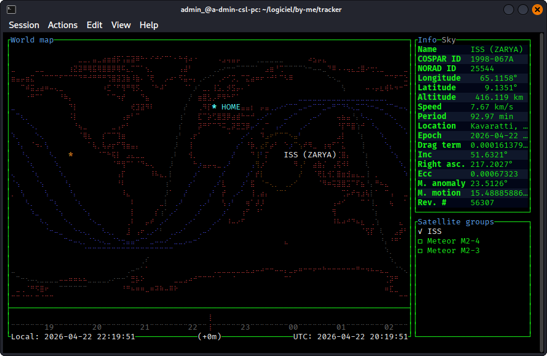

# tracker

A terminal-based real-time satellite tracking and orbit prediction application.

<p align="center">
    <br/>
</p>

## Features

- **Orbit propagation**: Real-time positions & trajectories using SGP4.
- **Detailed info**: Object information.
- **Sky view**: Polar azimuth/elevation plot.
- **Time shift**: View past/future positions.
- **Object following**: Follow selected object.
- **Infinite map**: Continuous horizontal world map.
- **Auto updates**: Automatic TLE updates.
- **Configurable**: Custom display & behavior.
- **NORAD ID support**: select satellites by catalog number.
- **Predicted passes**: pass popup with date display and minimum elevation filtering.
- **Localization**: UI translations.

## Installation

### Build from source

```bash
cargo install --git https://github.com/Admin202823/tracker
```

## Documentation

- [Configuration](docs/configuration.md).
- [Keymap](docs/keymap.md).

## License

Licensed under [Apache License, Version 2.0](LICENSE).
